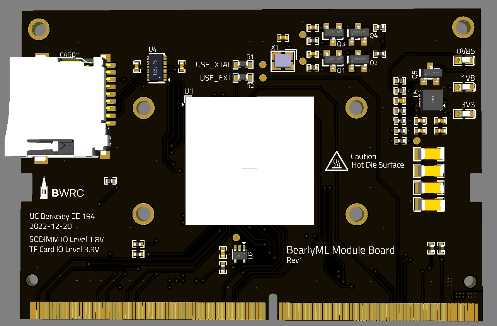
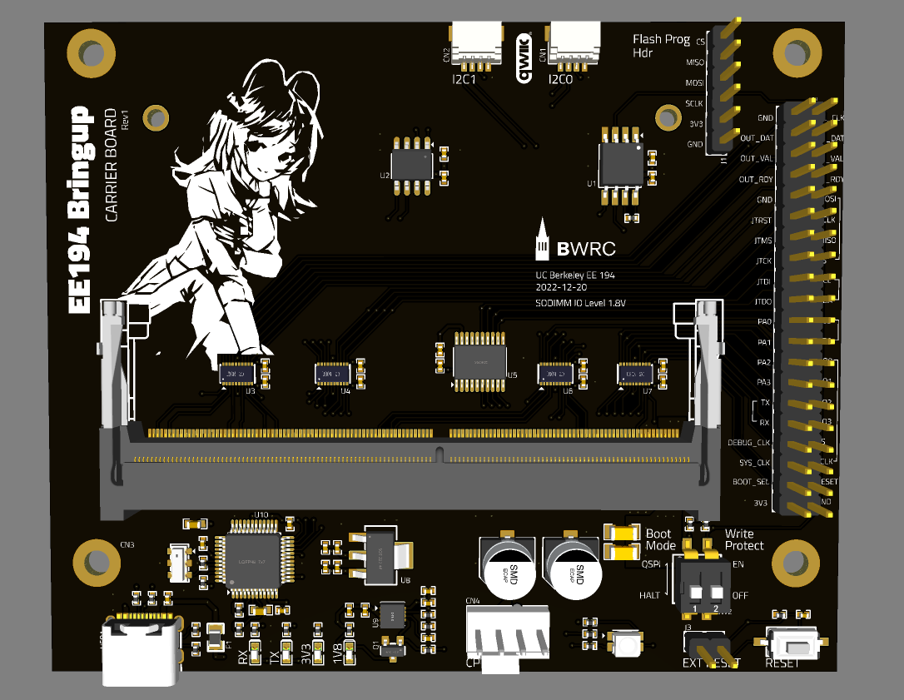

# BearlyML-PCB

This is the PCB for BearlyML 22 SoC chip, designed by EE 194/290C students in Spring 2022. 

## Functional Description

The design consists of two boards. The Module Board breaks out the chip BGA signals to the SODIMM connector. The Carrier Board contains most of the IO modules and level shifters. The Carrier Board can be swapped to different designs for different bringup setups or demo applications.

## Project Links

[BearlyML 2022 SoC Specification](https://docs.google.com/document/d/1Ldz2ZDB1uXTN-R59TmTNYh7_aXbSfiJJrKeP0uHo0qY/edit?usp=sharing)

[BearlyML 2022 Testing Note](https://docs.google.com/presentation/d/11BuBN2AjHtR5hc7lh9h7Z0UspvnxgiJxumvH6YZSuuI/edit?usp=sharing)

[PCB Design Review Slides](https://docs.google.com/presentation/d/1bnDwFzTTJ-bXILV92_7TXTGvEWACcQbSM0IduBUi0zo/edit?usp=sharing)

[PCB Project on GitHub](https://github.com/ucb-ee290c/BearlyML-PCB)

[PCB Project on Altium 365 - Module](https://ucb-bar.365.altium.com/designs/3D97ECBB-57EB-4ED6-8AAA-B185523FADBC#design)

[PCB Project on Altium 365 - Carrier](https://ucb-bar.365.altium.com/designs/955C9C27-6A6A-45D4-90F7-2286846251A1#design)

[PCB Project in BWRC-Boards](https://bwrcrepo.eecs.berkeley.edu/pcb/BearlyML-PCB)

## Schematic

[View on Altium 365](https://ucb-bar.365.altium.com/designs/3D97ECBB-57EB-4ED6-8AAA-B185523FADBC#design)

[Schematic PDF - Module](BearlyML_Module_Board/schematic-pdf/Schematic_BearlyML%20Module%20Board_2022-12-21.pdf)

[Schematic PDF - Carrier](BearlyML_Carrier_Board/schematic-pdf/Schematic_BearlyML%20Carrier%20Board_2022-12-21.pdf)

### Manufacture

[JLCPCB](https://jlcpcb.com/capabilities/Capabilities)

### Parameters

| Key | Value |
| ---- | ------ |
| Build Time | 5-6 days |
| Layers | 6  |
| PCB Qty | 5 |
| PCB Thickness | 1.2 mm for Module Board; 1.6 mm for Carrier Board |
| Base Material | FR-4 |
| Material Type | FR4-Standard TG 135-140 |
| Dimension | 79.6 mm* 71 mm for Module Board; 100 mm* 92 mm for Carrier Board |
| Product Type | Industrial/Consumer electronics |
| Impedance Control | no |
| Silkscreen | White |
| PCB Color | Black |
| Surface Finish | ENIG Gold Thickness: 1 U" |
| Via Covering | Epoxy Filled & Capped |
| Via Type | via-in-pad |
| Outer Copper Weight | 1 oz |
| Inner Copper Weight | 0.5 oz |
| Castellated Holes | no |
| Min hole size/diameter | 0.2/0.45mm |
| Flying Probe Test | Fully Test |
| Gold Fingers | Yes for Module Board |
| Remove Order Number | Specify a location |
| Appearance Quality | IPC Class 2 Standard |
| Silkscreen Technology | Ink-jet/Screen Printing Silkscreen |

Manufactured with [JLCPCB](https://jlcpcb.com/).

## Manufacture Cost

### Module Board

PCB: $18.58 each

Assembly: $17.64 each excluding BOM part cost

### Carrier Board

PCB: $17.81 each

Assembly: $21.90 each excluding BOM part cost

### Total

Total: $380 for 5 pcs

## 3D View

